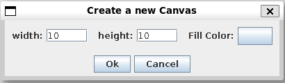
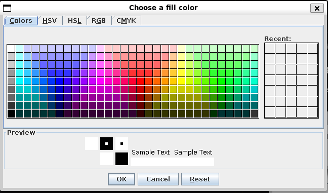
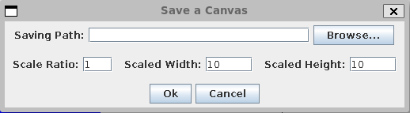
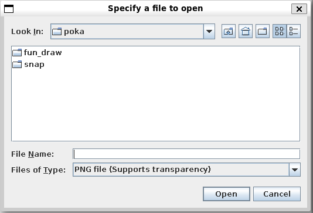

# Files Used in this Project
This Readme explains what the files & folders in FunDraw does and their purpose

## File Tree
```
├── README.md
├── This holds Images used in Readme(s)
├── resources
│   ├── bucket.png
│   ├── cursor.png
│   ├── eraser.png
│   ├── (...)
└── src
    ├── Main.java
    ├── README.md
    ├── dialogs
    │   ├── FillCanvas.java
    │   ├── NewCanvas.java
    │   └── SaveCanvas.java
    ├── fundraw
    │   ├── CanvasUndoManager.java
    │   ├── ColorButton.java
    │   ├── ColorPicker.java
    │   ├── ColorToggler.java
    │   ├── ControlPanel.java
    │   ├── GlobalKeyBinder.java
    │   ├── MainController.java
    │   ├── MainFrame.java
    │   ├── MainMenuBar.java
    │   ├── PixelCanvas.java
    │   ├── ToolPanel.java
    │   └── ToolSizeSlider.java
    ├── managers
    │   └── ImageFileManager.java
    └── tools
        ├── BrushTool.java
        ├── BucketTool.java
        ├── EraserTool.java
        ├── EyeDropperTool.java
        └── Tool.java
```

# What's inside /src ?

### Main.java
This file is the entry point of FunDraw.

## /dialogs
This Folder holds all the components that opens up a pop up window.

### NewCanvas.java
- This File opens up a pop up window asking the user to input width & height of the canvas
- Also asks user whether they would like to fill the canvas with a base color



### FillCanvas.java
- This File is a part of the NewCanvas.java pop up window.
- If the user chooses to fill the canvas with a solid color it will use this file to open up a color chooser window.
  


### SaveCanvas.java
- This File creates a pop up window to ask user whether they would like to save current work.
- Also allows user to use scaling function to enlarge the pixel art.



## /funpaint

### CanvasUndoManager.java
- This File holds the the core functions for the undo & redo functions

### ColorButton.java
- 


## /managers
This Folder is used to hold the File that control the File I/0 of FunDraw

### ImageFileManager.java
- This File is used to create the open PNG file pop-up window
- This also used to save the image from memory and also holds methods to resize the image



### ImageFileManager.java
- This file is used to open and resize the 
- Many of the functions are in the backend, except the open pop-up window

## /tools
This is where the core tools of FunDraw reside in. The program will not work without these.

### Tool.java
- This is the super class for all the files below:

### BrushTool.java
- This is where the Brush tool exists.

### BucketTool.java
- This is where the Bucket tool exists.
  
### EraserTool.java
- This is where the Eraser tool exists.

### EyeDropperTool.java
- This is the eye dropper tool exists